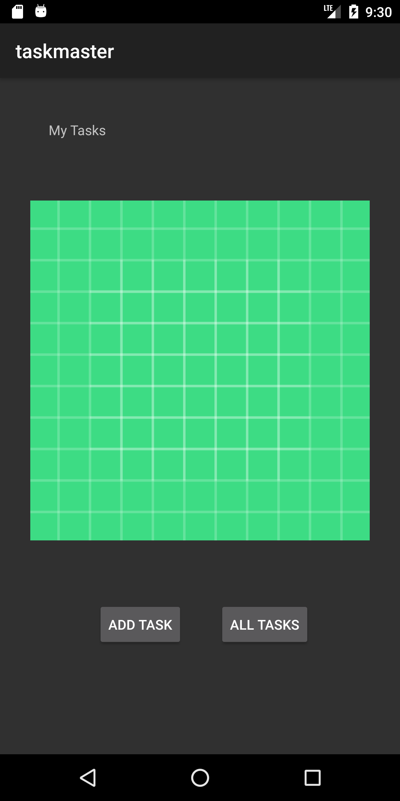
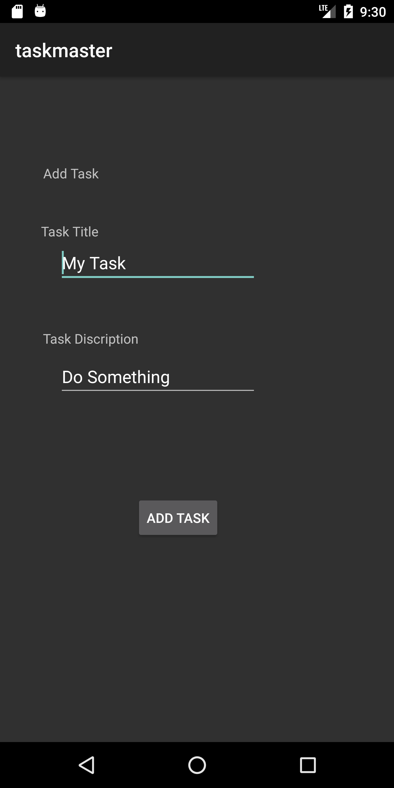
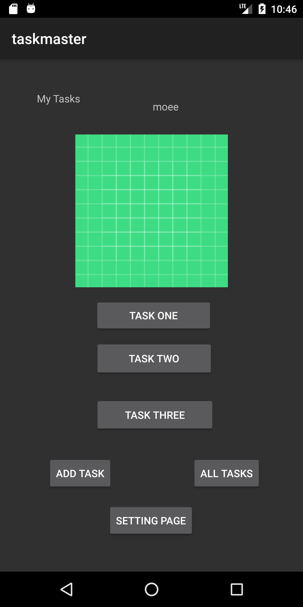
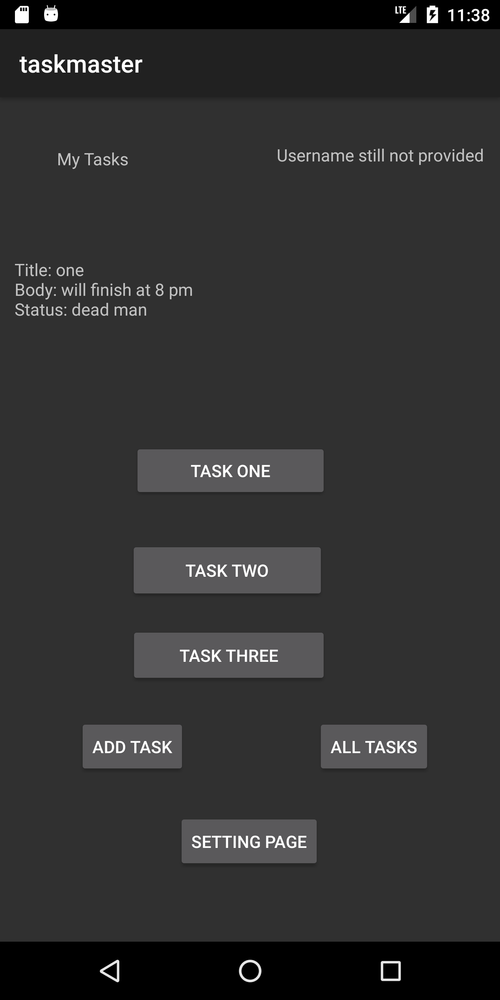
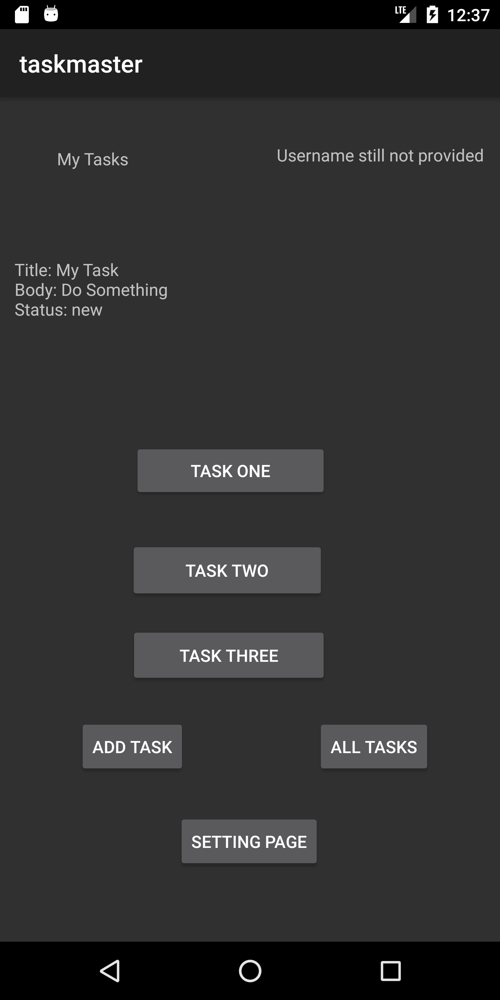

# Task Master

## LAB 26

* Create home page Activity.
  
* Create Task Activity.
  
* Create All tasks Activity.

* home
  
    * add task button take user to add activity screen
      
    * all tasks button take user to view all tasks activity screen.
      
    * contain 3 tasks button navigate user to details on task.
    * add setting page button
    
* add activity screen
  
    * add task button make submit new event
    
* add tasks details page
  
    * show the task title and description.
    
* add new setting page
  
    * user can add his name and update it's value.
      
    * name will appear in home page

## LAB 27

- **Task Details**: add a page with dynamic title and lorem description

## LAB 28

* add a recycler view with 3 tasks in the homepage 

## LAB 29

* A database was added so the user Can Save tasks from add task screen

## Lab 32

In this lab I changed the add task and main activity to create new tasks and save it to dynamoDB and also to retrieve the data from it
